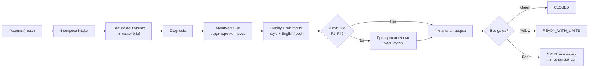

<div align="center">

# Palimpsest

### Профессиональный RU/EN skill для аккуратной редактуры с сохранением смысла, голоса и уровня английского

[](https://github.com/2612evgenii-hue/palimpsest/actions/workflows/ci.yml)
[](https://github.com/2612evgenii-hue/palimpsest/releases)
[](LICENSE)
[](https://www.python.org/)

**Актуальная версия: 3.2.0**

[Установка](#установка) · [Быстрый старт](#быстрый-старт) ·
[Возможности](#возможности) · [Как устроена проверка](#как-устроена-проверка) ·
[Ограничения](#честные-ограничения)

</div>

---

Palimpsest — это не «синонимайзер» и не набор трюков для обмана проверок.
Это воспроизводимый редакторский процесс: сначала понять весь текст, затем
диагностировать конкретные проблемы, внести минимальные обоснованные изменения
и проверить результат по текущим файлам и SHA-256.

Skill предназначен для эссе, статей, диссертаций, отчётов, рукописей,
технической и академической прозы на русском и английском языках.

## Главный принцип

> Качество текста важнее процента детектора, а сохранение смысла важнее
> косметической «человечности».

Palimpsest запрещает:

- выдумывать факты, источники, цитаты и результаты сервисов;
- менять причинность, модальность, числа, единицы или позиции автора ради score;
- использовать невидимый Unicode, homoglyphs, намеренные ошибки и metadata tricks;
- скрывать плагиат или удалять обязательную атрибуцию;
- обещать «необнаружимость» или точное определение авторства.

## Возможности

| Маршрут | Что делает | Когда включать |
|---|---|---|
| Базовая редактура | Полное чтение, diagnosis, semantic review, minimality, стиль и proofread | Всегда |
| `F1` | Уменьшает подтверждённые AI-like шаблоны минимальными смыслобезопасными правками | Если нужны текущие detector signals |
| `F2` | Исправляет механическую структуру, однообразный ритм и повторяющиеся переходы | Если структура действительно мешает жанру |
| `F3` | Проверяет факты по первичным и официальным источникам | Для фактических и исследовательских текстов |
| `F4` | Ищет close paraphrase, проблемы цитирования и атрибуции | Для академических и публикационных задач |
| Long-form | Карта всех сегментов, lossless sync и bounded memory между context resets | Для текстов от 4000 слов |

### Два режима стиля

1. `external_reference` — пользователь предоставляет отдельный образец своего
   письма. Из него переносятся решения и привычки, но не факты и не характерные
   фразы.
2. `source_as_reference` — внешнего образца нет. Редактируемый текст становится
   собственным стилевым эталоном и изменяется как можно меньше.

Вопрос о референсе задаётся всегда. Отсутствие референса не отключает style
control.

### Сохранение уровня английского

Для английского фиксируется `A1`–`C2`, `native` или
`infer_from_source`. Skill сохраняет:

- сложность лексики и синтаксиса;
- длину предложений и информационную плотность;
- естественную идиоматику;
- learner voice;
- исходную степень неидеальности без искусственного добавления ошибок.

Автоматический экран контролирует source-relative drift по нескольким
readability и complexity-признакам. Это не сертифицированная CEFR-оценка,
поэтому финальная side-by-side проверка обязательна.

## Рабочий процесс



## Установка

### Вариант 1 — клонирование прямо в проект

Из корня вашего проекта:

```bash
mkdir -p .agents/skills
git clone https://github.com/2612evgenii-hue/palimpsest.git \
  .agents/skills/palimpsest
```

После этого skill доступен по пути:

```text
.agents/skills/palimpsest/SKILL.md
```

### Вариант 2 — подключение как git submodule

Подходит, если вы хотите обновлять skill отдельно:

```bash
mkdir -p .agents/skills
git submodule add https://github.com/2612evgenii-hue/palimpsest.git \
  .agents/skills/palimpsest
git submodule update --init --recursive
```

Обновление:

```bash
git submodule update --remote .agents/skills/palimpsest
```

### Требования

- Python 3.10 или новее;
- стандартная библиотека Python — внешние пакеты для ядра не нужны;
- браузер только для реальных F1 detector observations;
- lawful existing access для institutional services.

## Быстрый старт

Создайте рабочую копию текста:

```bash
mkdir -p workspace
cp essay.md workspace/original.md
cp essay.md workspace/working.md
```

Инициализируйте state:

```bash
python3 scripts/state.py --state workspace/STATE.json init \
  --original workspace/original.md \
  --working workspace/working.md \
  --flags F1,F2
```

Затем последовательно зафиксируйте четыре ответа.

### Q1 — стиль и уровень английского

```bash
python3 scripts/state.py --state workspace/STATE.json intake \
  --question Q1 \
  --style-mode source_as_reference \
  --english-level B2 \
  --answer "Use the source as its own style baseline; preserve B2 English." \
  --source explicit
```

### Q2 — функции

```bash
python3 scripts/state.py --state workspace/STATE.json intake \
  --question Q2 \
  --functions F1,F2 \
  --answer "Enable F1 and F2." \
  --source explicit
```

### Q3 — детекторы

```bash
python3 scripts/state.py --state workspace/STATE.json intake \
  --question Q3 \
  --services zerogpt,copyleaks \
  --answer "Enable ZeroGPT and Copyleaks; disable optional services." \
  --source explicit
```

### Q4 — остальные требования

```bash
python3 scripts/state.py --state workspace/STATE.json intake \
  --question Q4 \
  --answer "English essay; preserve headings, citations, claims, and length." \
  --source explicit
```

Подробный сквозной пример: [docs/QUICKSTART.md](docs/QUICKSTART.md).

## Детекторы

При включённом `F1`:

- ZeroGPT обязателен по пользовательскому требованию проекта;
- ZeroGPT + Copyleaks — рекомендуемый минимальный независимый EN-набор;
- Copyleaks и остальные сервисы можно явно включать или выключать в Q3;
- GPTZero и Turnitin используются только при существующем законном доступе;
- агрегаторы не считаются независимыми detector groups;
- платные или registration-only сервисы не входят в default workflow.

Результат сохраняется только для точного service, target и content SHA.
Challenge и raw-capture binding защищают от случайно устаревшего файла, но не
являются криптографическим доказательством: локальный screenshot можно
сфабриковать.

Английский detector core основан на небольшом pilot corpus 3+3 и не является
population benchmark. Русский маршрут остаётся provisional.

Подробнее: [references/detectors.md](references/detectors.md).

## Как устроена проверка

State вычисляет гейты заново — команда ручного «покрасить зелёным» отсутствует.

| Gate | Проверка |
|---|---|
| `G0` | Intake, master brief, immutable original SHA и язык source |
| `G1` | Diagnosis и запуск pattern scan |
| `G2` | Активный стилевой baseline |
| `G3` | Текущие detector observations |
| `G4` | Структура при `F2` |
| `G5` | Claim ledger при `F3` |
| `G6` | Attribution и source overlap при `F4` |
| `G7` | Fidelity, semantic source-unit reconciliation и edit budget |
| `G8` | Style review и сохранение English level |
| `G9` | Constraints, proofread и чистый delivery text |
| `G10` | Итоговый отчёт |

Цвета:

- `green` — текущие требования подтверждены;
- `yellow` — есть честно зафиксированное ограничение;
- `red` — блокирующая проблема;
- `na` — маршрут не был выбран.

Жёлтый state нельзя закрыть локальной цитатой. Он получает
`READY_WITH_LIMITS` и требует отдельного внешнего решения пользователя.

## Long-form

Для длинного текста:

```bash
python3 scripts/segment.py map workspace/working.md \
  --out workspace/SEGMENTS.json
python3 scripts/segment.py --map workspace/SEGMENTS.json next
python3 scripts/segment.py --map workspace/SEGMENTS.json pack S001 --json
python3 scripts/segment.py --map workspace/SEGMENTS.json sync \
  --file workspace/working.md
python3 scripts/segment.py --map workspace/SEGMENTS.json status --json
```

`sync` сохраняет стабильные ID неизменённых сегментов, замечает новый хвост и
не допускает дыр в coverage. Hot memory остаётся ограниченной, а подробности
хранятся в cold notes.

## Тестирование

```bash
python3 -m compileall -q scripts evals
python3 evals/selftest.py
```

Релиз v3.2.0:

- adversarial acceptance: 22;
- broad regression: 58;
- synthetic long-form stress: 3;
- всего: **83 теста**.

Stress проверяет инфраструктуру на гетерогенном synthetic document 15k+ слов,
но не выдаётся за book-scale редакторскую апробацию.

## Структура репозитория

```text
.
├── SKILL.md                 # обязательный операционный контракт skill
├── agents/openai.yaml       # UI metadata
├── scripts/                 # state, fidelity, style, memory и segment tools
├── references/              # правила активных маршрутов
├── assets/                  # registry и шаблоны evidence
├── evals/                   # adversarial, regression и stress tests
├── docs/                    # русская документация
└── .github/                 # CI и templates для issues/PR
```

Архитектура: [docs/ARCHITECTURE.md](docs/ARCHITECTURE.md).

## Честные ограничения

- Ни один detector не доказывает авторство.
- CEFR и style metrics являются приближёнными измерительными экранами.
- Локально редактируемые state, JSON и screenshots не являются защищённым
  журналом.
- Полная защита от мотивированного агента требует внешней подписи или
  append-only host storage.
- Skill не обещает идеальный score, необнаружимость или отсутствие плагиата.
- Фактическое и смысловое решение остаётся ответственностью редактора и
  пользователя.

Полный список: [docs/LIMITATIONS.md](docs/LIMITATIONS.md).

## Участие в разработке

См. [CONTRIBUTING.md](CONTRIBUTING.md). Исправления принимаются вместе с
воспроизводимым failing case и regression test.

## Лицензия

[MIT](LICENSE) © 2026.
