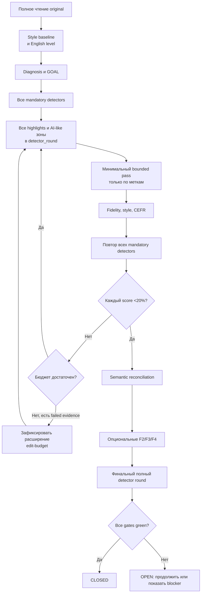

<div align="center">

# Palimpsest

### Профессиональный RU/EN skill: анализ → разметка → достаточная правка → полная перепроверка

[](https://github.com/2612evgenii-hue/palimpsest/actions/workflows/ci.yml)
[](https://github.com/2612evgenii-hue/palimpsest/releases)
[](LICENSE)
[](https://www.python.org/)

**Актуальная версия: 3.5.0**

[Установка](#установка) · [Быстрый старт](#быстрый-старт) ·
[Функции](#функции) · [F1 и детекторы](#f1-и-детекторы) ·
[Исследование 4.0](#исследование-40) · [Ограничения](#честные-ограничения)

</div>

---

Palimpsest — skill профессионального редактора, рерайтера и копирайтера для
русских и английских текстов. Он не переписывает материал «вслепую»: сначала
понимает весь текст, затем изучает почерк референса или самого исходника,
помечает конкретные проблемные зоны, начинает с минимальных обоснованных
изменений и повторяет полный цикл проверки. Если F1 требует более глубокого
rewrite, расширение edit envelope фиксируется отдельно и не выдаётся за
обычную корректуру.

Версия 3.5 возвращает исходный пользовательский контракт F1:

> Пока хотя бы один выбранный обязательный AI-детектор показывает 20% или
> больше, F1 не завершён. Hard pass — строго меньше 20% на каждом сервисе;
> рабочая цель — строго меньше 15%.

Plateau, waiver, средний score, один прошедший сервис или
`READY_WITH_LIMITS` не считаются успехом при высоком AI-score.

## Исследование 4.0

Версия skill по-прежнему `3.5.0`. Ветка `research/v4-minimal-edits` содержит
отдельное воспроизводимое исследование минимальных правок: hash-pinned
human/AI corpus, calibration/holdout split, однофакторные варианты, повторы,
human controls, CEFR/fidelity/style screens и Pareto-отбор.

Исследование публикует и отрицательные результаты. Scientific pilot нашёл
вариант с edit cost 0,73%, который прошёл ZeroGPT и Scribbr, но остался 99,6%
в Sapling. Новый canonical B1 pilot проверил десять однофакторных правок:
единственный повторяемый cross-service эффект составил лишь −0,9…−1 п.п.,
остался далеко выше порога, а правки в подсвеченных ZeroGPT зонах чаще
ухудшали score. Technical C1 pilot добавил ещё десять однофакторных вариантов
и прогрессивные пакеты: edit cost до 7,32% не сдвинул насыщенные 100% в
ZeroGPT/Scribbr, а уже четыре объединённые правки нарушили CEFR-envelope.
Human control при этом получил 38% в ZeroGPT, 0% в Scribbr и 99,1% в Sapling.
Первый preregistered PubMed holdout отверг перенос `split mechanism` ещё до
live-score: оба кандидата сохранили грубую метку C2, но вышли за допустимый
reading-grade envelope. Оба AI baseline затем дали 100% ×3 в ZeroGPT/Scribbr,
а четыре прошедших quality screen компаратора остались на 100%. Ни один вариант
не превращён в «рецепт». Новый preregistered baseline scout выбрал два
несатурированных AI-polish кейса для следующего микроэксперимента: ZeroGPT
стабилен на `63,7–63,8%` для scientific abstract и `76,3%` для formal news,
тогда как Scribbr дал тем же SHA соответственно `100%` и `0%`. Это
инструментальный отбор, не доказательство правила.

Preregistered `micro-01` затем проверил шесть естественных правок с edit cost
`0,30–4,29%`. Простое удаление оценочного маркера не перенеслось между двумя
текстами. Прямой субъект и прямое, source-supported утверждение формально
прошли calibration screen ZeroGPT без regression в Scribbr, однако cross-family
подтверждения нет: Scribbr остался на своих исходных крайних `100%`/`0%`, а
одна same-SHA ячейка ZeroGPT дала диапазон `0–76,2%`. Поэтому ни одно правило
не было добавлено в production skill. Copyleaks снова честно записан как
`scan_limit_reached`.

Transition-safe `holdout-02` затем отверг перенос
`direct_claim_restoration` на двух новых строгих EN-текстах. На scientific
образце ZeroGPT дал `0%` baseline и кандидату, поэтому эффект был
неизмерим; Scribbr изменился лишь `27% → 25%`. На formal-news human control и
AI baseline получили одинаковые `41,6%` ZeroGPT, а кандидат — `41,7%`;
Scribbr остался на полу `0%`. Результат — `0/2`, правило не допущено.
Это также запрещает трактовать «сделать claim прямее» как универсальный
detector-рецепт: такая правка остаётся только редакторским инструментом.

`Baseline-scout-02` затем проверил шесть новых AI-polish/human EN-пар и
впервые нашёл стабильное измерительное окно сразу в двух семьях. На
`news-polish-04` ZeroGPT дал human `30,3%` и AI `46,7%`, Scribbr — `0%` и
`29%`; все четыре ячейки повторились без шума. Technical pair формально прошёл
первичный отбор, но ZeroGPT AI same-SHA range составил `6,6 п.п.`, поэтому
исключён из следующего experiment scope. Scientific-03 остался
одно-сервисной диагностикой, а B1 AI-polish упёрся в `100%` обоих сервисов.
Итоговый следующий scope — только стабильный formal-news текст; правил
редактирования scout не проверял и не допустил.

На этом окне завершён preregistered `micro-02`: восемь отдельных
source-grounded правок стоимостью от `0,188%` до `6,61%`. Семь прошли
quality-first допуск, 34 live scans имели exact-SHA и transition signal.
Минимальный кандидат удалил только выдуманный `2022` из attribution
(`0,188%`) и стабильно снизил ZeroGPT `46,7 → 39%`, Scribbr `29 → 15%`
(`n=3`, range `0`). Полное восстановление цитаты за `6,61%` дало почти тот же
результат (`38,1% / 15%`), поэтому проиграло по minimality. Но общий фактор
«удалять неподтверждённые даты» провалился: удаление другого выдуманного года
подняло ZeroGPT до `71,3%`. Это location-specific calibration signal, а не
production-рецепт; требуется новый holdout и дополнительная detector family.

До новых detector scores уже заморожен `holdout-03`: три ранее не
сканированные formal-news пары, в каждой меняется только искажённая
AI-polish прямая цитата и её source-proven attribution. Edit cost кандидатов —
`3,97–7,26%`; все сохраняют C2 и exact reference binding. Confirmatory
независимая пара — ZeroGPT + Copyleaks, Scribbr служит guardrail, Sapling —
только диагностикой с обязательным human control из-за известных false
positives. Ни одного результата holdout пока нет; scope нельзя менять после
первых scores, а блокировка Copyleaks не разрешает подменить его другим
сервисом.

См.
[протокол](evals/research-v4/PROTOCOL.md),
[текущие результаты](evals/research-v4/FINDINGS.md) и
[машиночитаемые pilot-03](evals/research-v4/pilot-03-canonical.json) /
[pilot-04](evals/research-v4/pilot-04-b1-canonical.json) /
[pilot-05](evals/research-v4/pilot-05-tech-canonical.json) /
[holdout-01](evals/research-v4/holdout-01-pubmed-canonical.json) /
[baseline scout-01](evals/research-v4/baseline-scout-01-result.json) /
[micro-01](evals/research-v4/micro-01-result.json) /
[holdout-02](evals/research-v4/holdout-02-result.json) /
[baseline scout-02](evals/research-v4/baseline-scout-02-result.json) /
[micro-02](evals/research-v4/micro-02-result.json) /
[holdout-03 preregistration](evals/research-v4/holdout-03-preregistration.json).

Воспроизвести закреплённый corpus, варианты pilot-05 и проверку Pareto:

```bash
python3 scripts/research_corpus.py \
  --manifest evals/research-v4/corpus-manifest.json \
  --out-dir work/research-corpus
python3 scripts/research_variants.py \
  --original work/research-corpus/qa-tech-01-ai.txt \
  --plan evals/research-v4/qa-tech-01-variant-plan.json \
  --out-dir work/qa-tech-01-variants
python3 scripts/research_variants.py \
  --original work/research-corpus/qa-tech-01-ai.txt \
  --plan evals/research-v4/qa-tech-01-progressive-plan.json \
  --out-dir work/qa-tech-01-progressive
python3 scripts/research_pilot.py \
  --pilot evals/research-v4/pilot-05-tech-canonical.json
python3 scripts/research_scout.py \
  --result evals/research-v4/baseline-scout-01-result.json
python3 scripts/research_micro.py \
  --result evals/research-v4/micro-01-result.json
python3 scripts/research_holdout.py \
  --result evals/research-v4/holdout-02-result.json
python3 scripts/research_corpus.py \
  --manifest evals/research-v4/scout-02-corpus-manifest.json \
  --out-dir work/research-corpus-scout02
python3 scripts/research_scout.py \
  --result evals/research-v4/baseline-scout-02-result.json
python3 scripts/research_micro.py \
  --preregistration evals/research-v4/micro-02-preregistration.json
python3 scripts/research_micro.py \
  --result evals/research-v4/micro-02-result.json
python3 scripts/research_holdout.py \
  --preregistration evals/research-v4/holdout-03-preregistration.json
```

## Для чего нужен Palimpsest

| Маршрут | Результат |
|---|---|
| Базовая редактура | Полное понимание, diagnosis, минимальные moves, fidelity, style и proofread |
| `F1` | Итеративное снижение текущих detector scores по обязательному набору |
| `F2` | Менее механическая структура без разрушения жанра |
| `F3` | Глубокий факт-чек по первичным и официальным источникам |
| `F4` | Проверка close paraphrase, цитат, ссылок и атрибуции |
| Long-form | Полное сегментное покрытие и память между context resets |

Подходит для эссе, статей, диссертаций, отчётов, рукописей, технической и
академической прозы.

## Что изменилось в v3.5

- `score_mandatory` автоматически включается с F1;
- hard pass теперь строго `score <20%`, а не `<=20%`;
- target `<15%` учитывается отдельно и честно отражается в отчёте;
- repeatable EN-ядро без регистрации: ZeroGPT, Scribbr, GPTinf и Copyleaks;
- исходный набор из шести сервисов сохранён как явный optional profile;
- пользователь перед работой явно включает или выключает сервисы;
- GPTZero/QuillBot не включаются молча, когда live guest path требует sign-up;
- появился контролируемый `edit-budget` после фактического detector resistance;
- lexical fidelity false positives снимаются только exact semantic mapping;
- выдуманный `authorized_change` теперь оставляет G7 красным;
- explicit English level имеет приоритет над шумной readability-оценкой;
- добавлен digest-bound `detector_round` со всей матрицей scores и подсветок;
- каждая правка требует повторного прогона всех mandatory detectors;
- после F2/F3/F4 обязателен ещё один финальный полный detector round;
- plateau остаётся диагностикой, но всегда блокирует закрытие при score `>=20%`;
- waiver и sampled coverage запрещены в `score_mandatory`;
- F1 long-form всегда имеет полное покрытие;
- сохранены SHA binding, semantic reconciliation, fidelity, CEFR, style,
  capability integrity, anti-forgery и bounded memory.

Подробности: [CHANGELOG.md](CHANGELOG.md).

## Как работает редактор



## Стиль и уровень английского

Вопрос о референсе задаётся всегда.

1. `external_reference`: отдельные файлы задают почерк — развитие мысли,
   ритм, квалификации, локальные привычки. Фразы и факты не копируются.
2. `source_as_reference`: если внешнего образца нет, исходник сам становится
   стилевым эталоном и изменяется как можно меньше.

Для английского фиксируется `A1`–`C2`, `native` или `infer_from_source`.
Palimpsest не повышает B2 до «идеального академического» C1/C2 и не упрощает
его вниз. При этом он не добавляет искусственные ошибки. Если пользователь
явно выбрал B2, это решение важнее приблизительной машинной оценки исходника.

## Intake

Пользователь видит три основных вопроса:

1. Есть ли style-reference и какой English level сохранить?
2. Какие функции F1–F4 включить? Если выбран F1 — какие детекторы оставить
   обязательными?
3. Какие требования к структуре, письму и запретам соблюдать?

В state detector follow-up хранится отдельно, поэтому CLI использует Q1–Q4.
После ответов создаётся durable `goal` с точным условием завершения.

## F1 и детекторы

Repeatable EN-профиль без обязательной регистрации:

| Сервис | Роль в процессе |
|---|---|
| [ZeroGPT](https://www.zerogpt.com/) | Обязателен по постоянному пользовательскому предпочтению |
| [Scribbr](https://www.scribbr.com/ai-detector/) | Проверяется отдельно, но может дублировать QuillBot engine |
| [GPTinf](https://gptinf.com/detector) | Агрегатор; не заменяет прямой сервис |
| [Copyleaks](https://copyleaks.com/ai-content-detector) | Независимый прямой сигнал |

Для RU default — ZeroGPT, GPTinf и Copyleaks. GPTZero и QuillBot остаются
опциональными: текущий guest flow упирается в sign-up/лимит. Исходный
six-service profile никуда не удалён и может быть выбран явно.

Перед началом F1 пользователь явно включает или выключает сервисы. Каждый
оставленный сервис обязателен. Два бренда одного engine всё равно прогоняются,
если оба выбраны, но считаются одним голосом при анализе независимости.

Доступ и лимиты меняются, поэтому перед проектом заполняется
`capability_review`. Palimpsest не покупает аккаунты, не регистрируется и не
обходит ограничения. Blocked сервис не пропускается: пользователь должен
реальным новым сообщением изменить detector scope либо проект остаётся open.
Команда `detector-policy --services` в `score_mandatory` отклоняется; scope
после Q4 не перезаписывается локально вообще. После реального нового решения
пользователя создаётся новый state с новым Q3; старую detector evidence нельзя
переносить как current.

### Detector evidence

Для каждого service×target создаётся одноразовый challenge. Observation
привязывает:

- service и URL;
- current content SHA;
- timestamp;
- score и видимый excerpt;
- SHA screenshot/PDF/raw API response;
- структурную валидность и browser-sized dimensions изображения.

Затем `detector_round` фиксирует всю текущую матрицу, полноту просмотра
подсветок, адреса проблемных зон, анализ редактора и следующий шаг.

Это отклоняет stale-файлы, подмену registry facts и тривиальный fake-capture
вида «PNG header + случайные байты», но не является криптографическим
доказательством: локальный мотивированный агент всё ещё способен нарисовать
правдоподобный screenshot. Поэтому проценты никогда нельзя выдумывать.

## Установка

### Клонирование в проект

```bash
mkdir -p .agents/skills
git clone https://github.com/2612evgenii-hue/palimpsest.git \
  .agents/skills/palimpsest
```

Skill будет доступен как:

```text
.agents/skills/palimpsest/SKILL.md
```

### Git submodule

```bash
mkdir -p .agents/skills
git submodule add https://github.com/2612evgenii-hue/palimpsest.git \
  .agents/skills/palimpsest
git submodule update --init --recursive
```

### Требования

- Python 3.10+;
- стандартная библиотека Python для ядра;
- браузер для реальных F1 observations;
- lawful existing access для institutional services.

## Быстрый старт

```bash
mkdir -p workspace
cp essay.md workspace/original.md
cp essay.md workspace/working.md

python3 scripts/state.py --state workspace/STATE.json init \
  --original workspace/original.md \
  --working workspace/working.md \
  --flags F1,F2
```

Ответы intake:

```bash
python3 scripts/state.py --state workspace/STATE.json intake \
  --question Q1 --style-mode source_as_reference --english-level B2 \
  --answer "No external reference; preserve source handwriting and B2." \
  --source explicit

python3 scripts/state.py --state workspace/STATE.json intake \
  --question Q2 --functions F1,F2 \
  --answer "Enable F1 and F2." --source explicit

python3 scripts/state.py --state workspace/STATE.json intake \
  --question Q3 \
  --services zerogpt,scribbr,gptinf,copyleaks \
  --answer "Use the repeatable no-sign-up English profile." --source explicit

python3 scripts/state.py --state workspace/STATE.json intake \
  --question Q4 \
  --answer "Technical report; preserve headings, citations, and B2 English." \
  --source explicit
```

Полный сценарий: [docs/QUICKSTART.md](docs/QUICKSTART.md).

## Гейты

| Gate | Что блокирует или подтверждает |
|---|---|
| `G0` | Intake, GOAL, master brief, immutable original, source language |
| `G1` | Diagnosis и pattern scan |
| `G2` | Активный style baseline |
| `G3` | Все mandatory scores `<20%`, full coverage, current final round |
| `G4` | F2 structure review |
| `G5` | F3 claim ledger |
| `G6` | F4 overlap и attribution |
| `G7` | Fidelity, semantic reconciliation, edit budget |
| `G8` | Почерк и сохранение English level |
| `G9` | Требования, proofread, чистый delivery |
| `G10` | Итоговый отчёт |

Красный гейт блокирует `close`. Жёлтый допустим только для не-score
ограничений вроде provisional RU corpus; он не означает выполненный F1.

## Long-form

С F1 auto-route начинает стабильное сегментирование от 1,000 слов. Каждый
сегмент имеет SHA, а финальная матрица покрывает все targets. `risk_sampled` в
`score_mandatory` запрещён.

```bash
python3 scripts/segment.py map workspace/working.md \
  --out workspace/SEGMENTS.json --target 700 --min 400 --max 950
python3 scripts/segment.py --map workspace/SEGMENTS.json next
python3 scripts/segment.py --map workspace/SEGMENTS.json pack S001 --json
python3 scripts/segment.py --map workspace/SEGMENTS.json sync \
  --file workspace/working.md
```

## Тестирование

```bash
python3 -m compileall -q scripts evals
python3 evals/selftest.py
```

Suite объединяет broad regression, adversarial acceptance и heterogeneous
15k+ word stress. Он проверяет механику и устойчивость, но не доказывает
универсальную точность внешних детекторов.

Отдельно опубликован воспроизводимый отчёт о
[живой EN-апробации](docs/LIVE_ACCEPTANCE_3.5.md): baseline fail
63,1/100/100/100% после реального edit-cycle стал 5,3/0/0/0% на repeatable
no-sign-up core. Отчёт отдельно показывает большой diff, optional sign-up
blockers и границу DOM/screenshot evidence.

## Честные ограничения

- Детектор не доказывает авторство.
- Score и доступность могут измениться после обновления сервиса.
- Структурно валидный challenge-bound screenshot всё ещё можно подделать локально.
- CEFR и style metrics — экраны drift, а не сертификация.
- RU detector corpus остаётся provisional.
- При несовместимости `<20%` со смыслом skill оставляет воспроизводимый
  blocker и не объявляет успех.
- Palimpsest нельзя использовать для скрытия плагиата, удаления обязательной
  атрибуции или фабрикации evidence.

Подробнее: [docs/LIMITATIONS.md](docs/LIMITATIONS.md) и
[references/detectors.md](references/detectors.md).

## Состав

```text
palimpsest/
├── SKILL.md
├── agents/openai.yaml
├── scripts/
├── references/
├── assets/
├── evals/
└── docs/
```

## Лицензия

[MIT](LICENSE)
