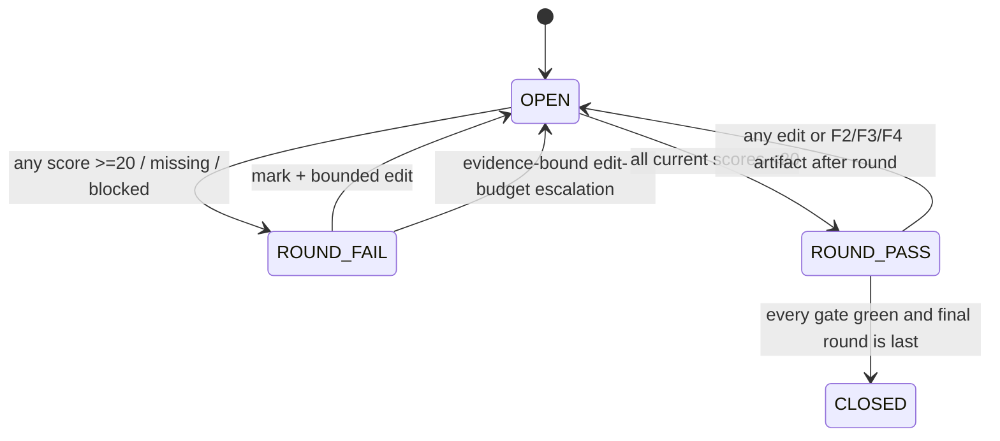
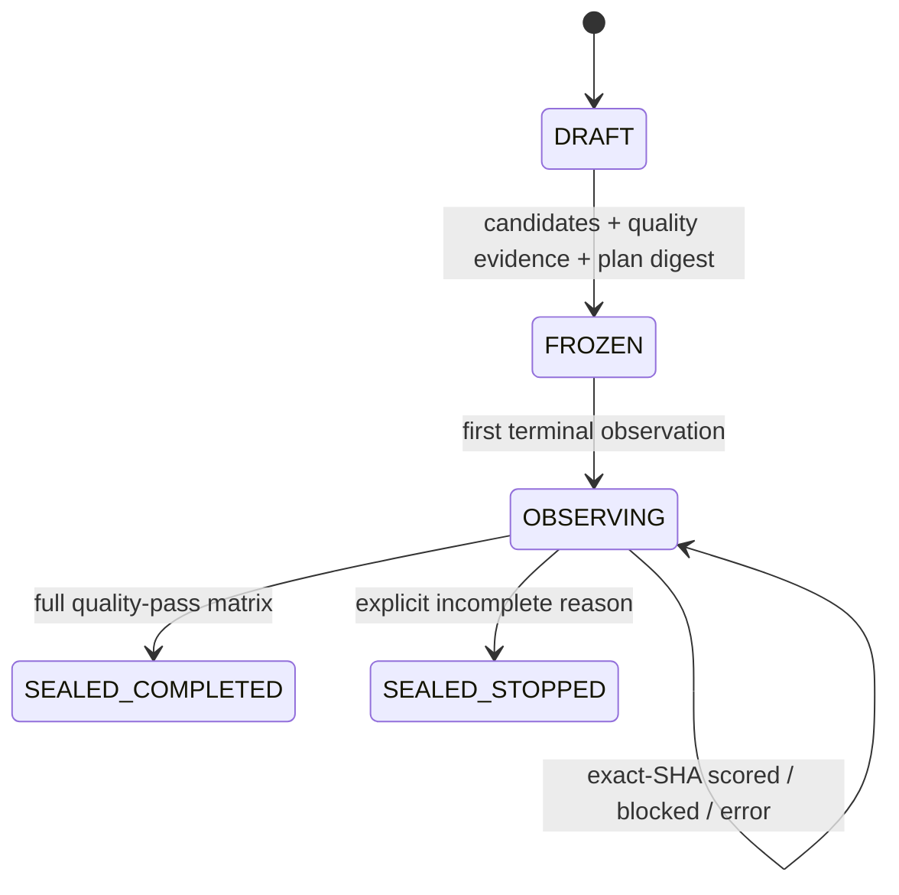

# Архитектура Palimpsest v3.5

## Слои

1. **Skill policy** — `SKILL.md` и routed references задают редакторский цикл.
2. **State machine** — `scripts/state.py` хранит GOAL, digests, artifacts,
   detector matrix и вычисляет gates.
3. **Deterministic screens** — fidelity, minimality, style, CEFR, overlap,
   annotations и segments.
4. **External evidence** — live browser/institutional observations.
5. **Memory** — stable segments, bounded hot index и cold notes.
6. **Shadow research** — optional privacy-first real-work cases с plan digest,
   exact-SHA observations и complete-case Pareto.

## F1 state flow

`score_mandatory` — инвариант F1, а не рекомендация. Comparison
`strictly_less_than`; hard threshold не может быть поднят выше 20. Sampled
coverage и detector waiver запрещены.

## Detector round

`detector_round` связывает:

- working SHA;
- explicit Q3 mandatory services;
- все current service×target results;
- observation SHA каждого результата;
- coverage declaration каждого UI;
- visible/manual problem zones;
- editor analysis и next action.

Artifact может быть валидным со статусом `requires_edit`, чтобы документировать
baseline. G3 становится green только для current round `pass`.

## Независимость и полнота

Каждый выбранный бренд должен пройти hard threshold. `independence_group`
используется дополнительно:

- Scribbr/QuillBot могут дать два UI результата, но один аналитический голос;
- aggregator не создаёт независимый голос;
- минимум независимых passing groups остаётся отдельной защитой.

## Staleness

Изменение `working` инвалидирует:

- detector observations через content SHA;
- detector round через working SHA;
- working-bound attestations;
- overlap и report;
- closure digest.

После Q4 intake immutable. Пользовательское изменение Q3 создаёт новый state;
capability, results, rounds, plateaus и waivers старого state не переносятся.

## Long-form

F1 использует только full coverage. Stable segment map связывает каждый target
с SHA и не допускает дыр. Размер 400–950 слов рассчитан на наименьшие общие
публичные word limits. Worst target определяет итог сервиса.

## Trust boundary

State защищает от stale и изменённого evidence, но не аутентифицирует pixels,
пользовательские цитаты или человека. Поэтому:

- bare score запрещён;
- registry facts неизменяемы;
- local waiver не завершает score_mandatory;
- semantic authorized change оставляет G7 red; подтверждённую смысловую правку
  нужно перенести в новый immutable source baseline;
- никаких обещаний авторства или будущей необнаружимости.

## Shadow state flow

`delivery_only` запрещает aggregate research. `private_research` требует
отдельного consent hash и три повтора. Freeze не доказывает внешнее время, но
делает последующую подмену candidate/hypothesis заметной. Shadow-layer не
заменяет F1 gates `state.py` и никогда не публикует raw client text. Terminal
seal связывает observations и пересчитанный summary; post-seal mutation
отклоняется.
