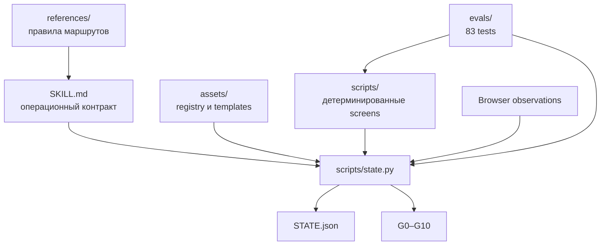

# Архитектура Palimpsest

## Компоненты

## State

`STATE.json` хранит:

- init SHA immutable original;
- определённый язык source;
- ответы Q1–Q4;
- активные функции и detector policy;
- SHA зарегистрированных artifacts;
- detector challenges, observations, plateaus и waivers;
- editor moves;
- последнюю verification matrix.

Гейты не хранятся как редактируемая истина. Они пересчитываются командой
`verify`.

## Evidence binding

Каждый working-bound artifact содержит SHA текущего текста. После изменения
working file он становится stale.

Detector observation связывает:

- service и target;
- current content SHA;
- одноразовый challenge и nonce;
- время результата;
- URL сервиса;
- visible score excerpt;
- SHA screenshot, PDF или vendor JSON.

Это защищает от случайной подмены старого evidence, но не от фабрикации
локального файла.

## Semantic reconciliation

Для каждого source unit хранится:

- immutable source ID, SHA и excerpt;
- verdict;
- точный working excerpt;
- `start_char`/`end_char`;
- rationale.

Mappings не могут пересекаться, повторно использовать один диапазон или
нарушать порядок. `authorized_change` остаётся yellow, поскольку local CLI не
удостоверяет согласие пользователя.

## Long-form

`segment.py` гарантирует:

- покрытие каждого символа;
- устойчивые ID неизменённых сегментов;
- обнаружение нового и изменённого текста;
- отсутствие невидимого appended tail;
- привязку evidence к digest, а не только к segment ID.

`memory.py` отделяет компактную hot memory от cold notes и не пытается
восстановить потерянный контекст из догадок.

## Trust boundary

Palimpsest — fail-closed workflow, но не security enclave. Процесс с полным
доступом к workspace способен переписать state и нарисовать screenshot.
Криптографическая защита требует внешнего signer или append-only host storage.
